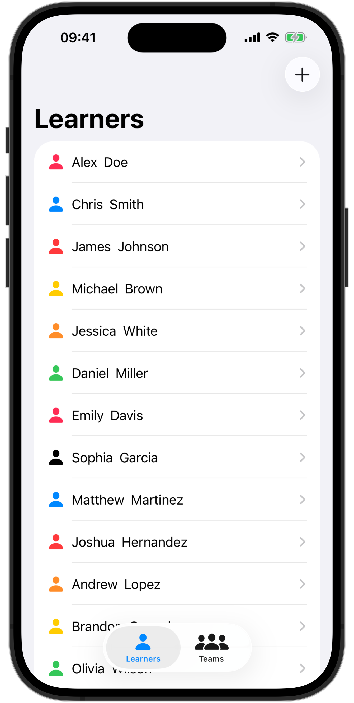
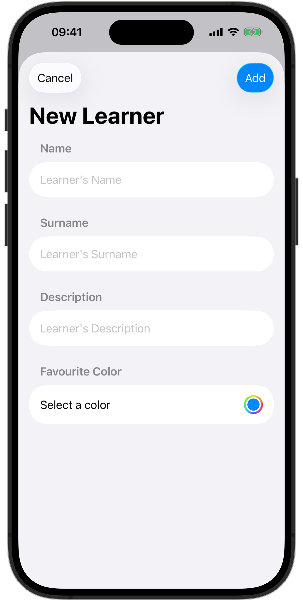

<div align="center">
  <h3>Lab</h3>
  <h1>Data Flow</h1>
  <br />
  <a href="https://github.com/developer-academy-unina/Lab-Data-Flow/issues/new?assignees=&labels=bug&template=01_BUG_REPORT.md&title=bug%3A+">Report a Bug</a>
  ·
  <a href="https://github.com/developer-academy-unina/Lab-Data-Flow/discussions">Ask a Question</a>
  
</div>
  <br />
<p align="center">
  <a href="#" alt="Xcode Version">
    
  </a>        
  <a href="#" alt="Swift Version">
    
  </a>
  <a href="#" alt="Framework used">
    
  </a>          
</p>

<details open="open">
<summary>Table of Contents</summary>

- [About](#about)
- [Getting Started](#getting-started)
  - [Installation](#installation)
  - [How to](#how-to)
- [Issues and Discussions](#issues-and-discussions)
- [Support](#support)
- [Authors & contributors](#authors--contributors)
- [License](#license)

</details>

---
<br />

## About

Mastering the ```Data Flow``` is essential when building your SwiftUI apps. Use this project to learn how to use SwiftUI's State, Binding, and the Observable Object protocol. In conclusion, take a look at how passing the data in the Environment works. 

<summary>Screenshots</summary>
<br>

|                           Learner List View                           |                            New Learner View                            |
| :-------------------------------------------------------------------: | :--------------------------------------------------------------------: |
|  |  |

<br />

## Getting Started

### Installation

1. Clone the repo

   ```sh
   git clone https://github.com/developer-academy-unina/Lab-Data-Flow
   ```

2. Open the ```.xcodeproj``` file

### How to

1. Open the Starter project

2. Create the ```NewLearnerView``` like shown in the picture above

3. Implement the modal navigation to add a new learner by using the ```State``` and ```Binding``` mechanism from ```LearnerListView``` to ```NewLearnerView```

4. Pass the function to add new learners in ```NewLearnerView``` as a parameter

4. Add the function to add a new learner and delete them in the ```LearnerViewModel```

5. Mark the LearnerViewModel as with the ```@Observable``` macro to refresh the interface whenever changes in the data occur

6. Experiment with the ```Environment``` by creating the instance of ```LearnerViewModel``` in the ```LearnersApp.swift``` file (the app entry point), feeding it to the Environment of the ```TabView``` (by using the ```.environment(:_)``` modifier), and retrieving it from the Environment in the Views that need the data (don't forget to provide the Views' Previews with the environment instance, otherwise the previews will crash)

7. Connect the functions to the buttons' actions

6. Launch the app on the simulator and check if your version is similar to the Final project

<br />

## Issues and Discussions

You've found a bug in the source code, a mistake in the documentation or maybe you'd like a new feature? Take a look at [GitHub Discussions](https://github.com/developer-academy-unina/Lab-Data-Flow/discussions) to see if it's already being discussed. You can help us by [submitting an issue on GitHub](https://github.com/developer-academy-unina/Lab-Data-Flow/issues). Before you create an issue, make sure to search the issue archive -- your issue may have already been addressed!

Please try to create bug reports that are:

- _Reproducible._ Include steps to reproduce the problem.
- _Specific._ Include as much detail as possible: which version, what environment, etc.
- _Unique._ Do not duplicate existing opened issues.
- _Scoped to a Single Bug._ One bug per report.

<br />

## Support

Reach out to the maintainer at one of the following places:

- [GitHub Discussions](https://github.com/developer-academy-unina/Lab-Data-Flow/discussions)
- [GitHub issues](https://github.com/developer-academy-unina/Lab-Data-Flow/issues/new?assignees=&labels=question&template=04_SUPPORT_QUESTION.md&title=support%3A+)
- Contact a Mentor for any other help

<br />

## Authors & contributors

The original setup of this repository is by [Luca Palmese](https://github.com/pal-luke).

For a full list of all authors and contributors, see [the contributors page](https://github.com/developer-academy-unina/Lab-Data-Flow/contributors).

<br />

## License

This project is licensed under the **MIT License**.

See [LICENSE](LICENSE) for more information.
